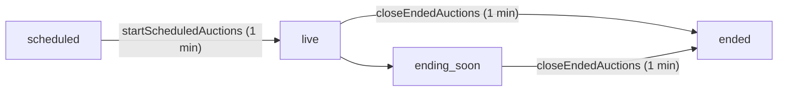

# Cloud Functions — Issue Report

> **Files:** All files in [`functions/src/`](file:///c:/Users/Bhyresh%20BS/Documents/Bhyresh/Programs/KalaSethu/functions/src)
>
> **Last updated:** 2026-06-27 — audit resolution pass + `startScheduledAuctions`

---

## Summary

The Cloud Functions layer handles payment processing, auction management, notifications, admin actions, and background jobs. A production-safe fix pass addressed critical security, data-consistency, and batch-limit bugs. Scheduled auction lifecycle is now covered end-to-end: **scheduled → live** (`startScheduledAuctions`) and **live/ending_soon → ended** (`closeEndedAuctions`).

| Status | Count |
|--------|-------|
| Resolved | 12 |
| Verified (already fixed) | 1 |
| Remaining / deferred | 4 |

---

## Resolved Issues

### ✅ C-01 — `verifyPayment` Trusts Client-Supplied Prices `[RESOLVED]`
**File:** [`payment.ts`](file:///c:/Users/Bhyresh%20BS/Documents/Bhyresh/Programs/KalaSethu/functions/src/payment.ts)
**Was:** Client `item.price` used for order totals.
**Fix:** Fetches artworks from Firestore; validates `published` + `fixed_price`; uses server `price`; verifies Razorpay `orders.fetch` amount matches server total (paise); idempotency via `paymentId` query; order creation + `sold` updates in `runTransaction`.

### ✅ C-03 — `closeEndedAuctions` Queries Non-Existent Status `[RESOLVED]`
**File:** [`auction.repository.ts`](file:///c:/Users/Bhyresh%20BS/Documents/Bhyresh/Programs/KalaSethu/functions/src/repositories/auction.repository.ts), [`auction.ts`](file:///c:/Users/Bhyresh%20BS/Documents/Bhyresh/Programs/KalaSethu/functions/src/auction.ts)
**Was:** Queried `status == 'active'`.
**Fix:** `getActiveEndedAuctions` now uses `status in ['live', 'ending_soon']` with `endsAt <= now`. Uses `ChunkedBatchWriter` for notification batches.

### ✅ C-07 — `admin.ts` Bypasses Shared DB Config `[RESOLVED]`
**File:** [`admin.ts`](file:///c:/Users/Bhyresh%20BS/Documents/Bhyresh/Programs/KalaSethu/functions/src/admin.ts) (+ `auth.ts`, `community.ts`, `notification.ts`, `artwork.ts`)
**Was:** `const db = admin.firestore()` without guarded init.
**Fix:** All modules import `{ db }` from [`config.ts`](file:///c:/Users/Bhyresh%20BS/Documents/Bhyresh/Programs/KalaSethu/functions/src/config.ts).

### ✅ H-01 — `onUserCreated` Assigns Invalid `'collector'` Role `[VERIFIED — NO CHANGE NEEDED]`
**File:** [`auth.ts`](file:///c:/Users/Bhyresh%20BS/Documents/Bhyresh/Programs/KalaSethu/functions/src/auth.ts)
**Status:** Already assigns `role: 'user'`. Frontend normalizes legacy `collector` → `user`.

### ✅ H-04 / H-09 — `onArtworkWritten` Unnecessary Re-invocation `[RESOLVED]`
**File:** [`artwork.ts`](file:///c:/Users/Bhyresh%20BS/Documents/Bhyresh/Programs/KalaSethu/functions/src/artwork.ts)
**Fix:** Early return when write is keyword-maintenance only (`title`, `category`, `status`, `artistId` unchanged). Keyword updates omit `updatedAt`.

### ✅ H-05 — Follower Notification Batch Exceeds 500-op Limit `[RESOLVED]`
**File:** [`artwork.ts`](file:///c:/Users/Bhyresh%20BS/Documents/Bhyresh/Programs/KalaSethu/functions/src/artwork.ts), [`utils/batch-commit.ts`](file:///c:/Users/Bhyresh%20BS/Documents/Bhyresh/Programs/KalaSethu/functions/src/utils/batch-commit.ts)
**Fix:** `ChunkedBatchWriter` commits follower notifications in 450-op chunks.

### ✅ H-11 — Comment Counter Can Go Negative `[RESOLVED]`
**File:** [`community.ts`](file:///c:/Users/Bhyresh%20BS/Documents/Bhyresh/Programs/KalaSethu/functions/src/community.ts)
**Fix:** `onCommentRemoved` uses a transaction; decrements only if `commentCount > 0`. Same floor guard on `followerCount` / `followingCount` decrements.

### ✅ N+1 — `notification.ts` Query Loop `[RESOLVED]`
**File:** [`notification.ts`](file:///c:/Users/Bhyresh%20BS/Documents/Bhyresh/Programs/KalaSethu/functions/src/notification.ts)
**Was:** Looped all users, one subcollection query each.
**Fix:** Paginated `collectionGroup('notifications').where('createdAt', '<', cutoff).limit(500)` delete loop.
**Deploy note:** A composite `COLLECTION_GROUP` index on `notifications.createdAt` is **not required** — Firestore serves single-field collection-group range queries via automatic indexing. Do **not** add it to `firestore.indexes.json` (deploy returns HTTP 400: *"this index is not necessary"*).

### ✅ M-21 — `onOrderCreated` Inconsistent Notification Types `[RESOLVED]`
**File:** [`order.ts`](file:///c:/Users/Bhyresh%20BS/Documents/Bhyresh/Programs/KalaSethu/functions/src/order.ts)
**Fix:** Buyer `order_placed`; seller `payment_received` (aligned with `NotificationType` in `app/types/index.ts`).

### ✅ Region Configuration `[PARTIALLY RESOLVED]`
**Files:** All trigger/scheduled modules
**Fix:** `asia-south1` added to scheduled, Firestore, and Auth triggers. Callable HTTPS functions already used `asia-south1`.

### ✅ Scheduled → Live Auction Transition `[RESOLVED — NEW]`
**File:** [`auction.ts`](file:///c:/Users/Bhyresh%20BS/Documents/Bhyresh/Programs/KalaSethu/functions/src/auction.ts), [`auction.repository.ts`](file:///c:/Users/Bhyresh%20BS/Documents/Bhyresh/Programs/KalaSethu/functions/src/repositories/auction.repository.ts)
**Was:** Auctions created with `status: 'scheduled'` never transitioned to `live` unless `startsAt` was already past at creation time.
**Fix:** `startScheduledAuctions` runs every 1 minute in `asia-south1`; queries `status == 'scheduled'` + `startsAt <= now`; batch-updates to `live`. Idempotent (only `scheduled` docs selected). Requires composite index: `auctions` — `status` + `startsAt` (in [`firestore.indexes.json`](file:///c:/Users/Bhyresh%20BS/Documents/Bhyresh/Programs/KalaSethu/firestore.indexes.json)).

### ✅ Silent — Auction Notification Batch Limits `[RESOLVED]`
**File:** [`auction.ts`](file:///c:/Users/Bhyresh%20BS/Documents/Bhyresh/Programs/KalaSethu/functions/src/auction.ts)
**Fix:** `closeEndedAuctions` and `auctionEndingSoon` use `ChunkedBatchWriter` to avoid 500-op batch failures with many bidders.

---

## Remaining Issues

### 🟡 M-22 — `aggregateAnalytics` Limited Metrics `[DEFERRED]`
**File:** [`admin.ts`](file:///c:/Users/Bhyresh%20BS/Documents/Bhyresh/Programs/KalaSethu/functions/src/admin.ts)
**Description:** Only 3 count metrics. No revenue, DAU, retention, or conversion.

### 🟡 — `createOrder` Accepts Client-Supplied Amount `[MITIGATED, NOT CLOSED]`
**File:** [`payment.ts`](file:///c:/Users/Bhyresh%20BS/Documents/Bhyresh/Programs/KalaSethu/functions/src/payment.ts)
**Description:** `createOrder` still trusts client `amount` when creating the Razorpay order. `verifyPayment` now rejects mismatches against server-side artwork prices and Razorpay captured amount. Defense-in-depth: validate amount server-side at order creation too.

### 🔵 — All Functions Use v1 API `[DEFERRED]`
**Description:** All Cloud Functions use `firebase-functions/v1`. Firebase recommends v2 for better performance, concurrency, and cost optimization.

### 🔵 — v1 → v2 Migration `[DEFERRED]`
Incremental migration recommended starting with `verifyPayment` and `placeBid` callables.

---

## Deployment Checklist

```bash
# 1. Indexes (auctions status+startsAt for startScheduledAuctions)
firebase deploy --only firestore:indexes

# 2. Build + deploy functions
cd functions && npm run build
firebase deploy --only functions
```

**Index deploy gotcha:** If deploy fails on a `notifications` `COLLECTION_GROUP` / `createdAt` composite index, remove that entry — it is redundant with Firestore single-field auto-indexing.

---

## Auction Lifecycle (post-fix)



---

## Regression Risks (post-deploy)

- **`verifyPayment` transaction:** Multi-item carts increase transaction reads/writes (typical 1–5 items are fine).
- **`cleanupOldNotifications`:** Relies on automatic single-field collection-group index for `createdAt`.
- **Region redeploy:** Scheduled/trigger functions may briefly recreate on deploy.
- **Stricter payments:** Tampered prices or unavailable artworks are now rejected (intended).
