# KalaSetu — Database Blueprint & Migration Strategy

> **Version:** 1.0  
> **Purpose:** Future-proof database reference for migration from Firestore to PostgreSQL/Supabase/MySQL  
> **Current Backend:** Firebase Firestore (NoSQL Document Store)

---

## Entity Relationship Diagram

```mermaid
erDiagram
    USERS {
        string id PK
        string displayName
        string email
        string phone
        string role
        string avatarUrl
        string bio
        string location
        boolean isVerified
        boolean isEmailVerified
        boolean isBanned
        string specialty
        int artworkCount
        int followerCount
        int followingCount
        int salesCount
        float totalRevenue
        string provider
        boolean onboardingComplete
        timestamp createdAt
        timestamp updatedAt
        timestamp lastLoginAt
    }

    ARTWORKS {
        string id PK
        string artistId FK
        string title
        string description
        float price
        string currency
        string listingType
        string category
        string medium
        string dimensions
        int year
        string[] tags
        string thumbnailUrl
        string status
        boolean isFeatured
        boolean isCommissionable
        string provenance
        int viewCount
        int likeCount
        int favoriteCount
        timestamp createdAt
        timestamp publishedAt
    }

    AUCTIONS {
        string id PK
        string artworkId FK
        string artistId FK
        string type
        float startPrice
        float reservePrice
        float currentBid
        float minIncrement
        timestamp startsAt
        timestamp endsAt
        string status
        int totalBids
        int uniqueBidders
        string winnerId FK
        float winningBid
        timestamp createdAt
    }

    BIDS {
        string id PK
        string auctionId FK
        string bidderId FK
        float amount
        string status
        timestamp timestamp
    }

    ORDERS {
        string id PK
        string buyerId FK
        string sellerId FK
        float subtotal
        float shippingCost
        float tax
        float totalAmount
        string currency
        string paymentStatus
        string status
        string buyerNotes
        string sellerNotes
        timestamp createdAt
        timestamp updatedAt
    }

    ORDER_ITEMS {
        string id PK
        string orderId FK
        string artworkId FK
        string artistId FK
        float price
        int quantity
    }

    PAYMENTS {
        string id PK
        string orderId FK
        string razorpayOrderId
        string razorpayPaymentId
        float amount
        string currency
        string status
        string method
        string refundId
        float refundAmount
        timestamp createdAt
    }

    TRANSACTIONS {
        string id PK
        string type
        string fromUserId FK
        string toUserId FK
        float amount
        string currency
        string paymentId FK
        string orderId FK
        string description
        timestamp createdAt
    }

    POSTS {
        string id PK
        string authorId FK
        string type
        string title
        string content
        string artworkId FK
        string category
        int likeCount
        int commentCount
        int shareCount
        boolean isTrending
        timestamp createdAt
        timestamp updatedAt
    }

    COMMENTS {
        string id PK
        string postId FK
        string authorId FK
        string content
        string parentCommentId FK
        int likeCount
        int replyCount
        timestamp createdAt
    }

    FOLLOWS {
        string followerId FK
        string followingId FK
        timestamp createdAt
    }

    FAVORITES {
        string id PK
        string userId FK
        string targetId
        string targetType
        timestamp createdAt
    }

    CHAT_ROOMS {
        string id PK
        string type
        timestamp createdAt
        timestamp updatedAt
    }

    MESSAGES {
        string id PK
        string chatRoomId FK
        string senderId FK
        string type
        string content
        string mediaUrl
        string artworkId FK
        boolean isDeleted
        timestamp createdAt
    }

    EVENTS {
        string id PK
        string organizerId FK
        string title
        string description
        string type
        string mode
        string status
        timestamp startDate
        timestamp endDate
        string city
        int maxCapacity
        int registrationCount
        boolean isFree
        float price
        timestamp createdAt
    }

    EVENT_REGISTRATIONS {
        string id PK
        string eventId FK
        string userId FK
        string status
        string ticketNumber
        timestamp registeredAt
    }

    WORKSHOPS {
        string id PK
        string instructorId FK
        string title
        string description
        string level
        string mode
        int maxCapacity
        int enrolledCount
        boolean isFree
        float price
        float averageRating
        int reviewCount
        string status
        timestamp startDate
        timestamp createdAt
    }

    WORKSHOP_ENROLLMENTS {
        string id PK
        string workshopId FK
        string userId FK
        string status
        string certificateUrl
        timestamp enrolledAt
        timestamp completedAt
    }

    NOTIFICATIONS {
        string id PK
        string userId FK
        string type
        string title
        string message
        string relatedId
        string relatedType
        boolean isRead
        timestamp createdAt
    }

    REPORTS {
        string id PK
        string reporterId FK
        string targetId
        string targetType
        string reason
        string description
        string status
        string severity
        string reviewerId FK
        timestamp createdAt
        timestamp resolvedAt
    }

    ARTIST_VERIFICATIONS {
        string id PK
        string artistId FK
        string artForm
        string experience
        string status
        string reviewerId FK
        timestamp badgeGrantedAt
        timestamp badgeExpiresAt
        timestamp submittedAt
        timestamp reviewedAt
    }

    CATEGORIES {
        string id PK
        string name
        string slug
        string parentId FK
        int artworkCount
        int order
    }

    ADMIN_LOGS {
        string id PK
        string adminId FK
        string action
        string targetId
        string targetType
        string details
        timestamp timestamp
    }

    USERS ||--o{ ARTWORKS : "creates"
    USERS ||--o{ AUCTIONS : "runs"
    USERS ||--o{ BIDS : "places"
    USERS ||--o{ ORDERS : "buys"
    USERS ||--o{ ORDERS : "sells"
    USERS ||--o{ POSTS : "authors"
    USERS ||--o{ COMMENTS : "writes"
    USERS ||--o{ FOLLOWS : "follows"
    USERS ||--o{ FOLLOWS : "is-followed-by"
    USERS ||--o{ FAVORITES : "saves"
    USERS ||--o{ NOTIFICATIONS : "receives"
    USERS ||--o{ EVENTS : "organizes"
    USERS ||--o{ WORKSHOPS : "teaches"
    USERS ||--o{ ARTIST_VERIFICATIONS : "applies-for"
    ARTWORKS ||--o{ AUCTIONS : "listed-in"
    ARTWORKS ||--o{ ORDER_ITEMS : "purchased-as"
    AUCTIONS ||--o{ BIDS : "receives"
    ORDERS ||--o{ ORDER_ITEMS : "contains"
    ORDERS ||--o| PAYMENTS : "paid-via"
    PAYMENTS ||--o{ TRANSACTIONS : "generates"
    POSTS ||--o{ COMMENTS : "has"
    COMMENTS ||--o{ COMMENTS : "replied-to-by"
    CHAT_ROOMS ||--o{ MESSAGES : "contains"
    EVENTS ||--o{ EVENT_REGISTRATIONS : "has"
    WORKSHOPS ||--o{ WORKSHOP_ENROLLMENTS : "has"
    CATEGORIES ||--o{ CATEGORIES : "parent-of"
```



---

## Firestore → SQL Collection Mapping

### Core Entity Tables

| Firestore Collection | SQL Table | Notes |
|---|---|---|
| `users` | `users` | Direct 1:1 |
| `artworks` | `artworks` | Direct 1:1 |
| `auctions` | `auctions` | Direct 1:1 |
| `bids` | `bids` | Direct 1:1 |
| `orders` | `orders` | 1:1, but `items[]` → separate `order_items` table |
| `payments` | `payments` | Direct 1:1 |
| `transactions` | `transactions` | Direct 1:1 |
| `carts` | `cart_items` | Cart = per-user rows in `cart_items` |
| `favorites` | `favorites` | Direct 1:1 |
| `collections` | `user_collections` | `artworkIds[]` → `collection_artworks` join table |
| `posts` | `posts` | `tags[]` → `post_tags` join table |
| `chatRooms` | `chat_rooms` | `participants[]` → `chat_participants` join table |
| `events` | `events` | Direct 1:1 |
| `workshops` | `workshops` | `syllabus[]` + `materials[]` → JSON columns or sub-tables |
| `notifications` | `notifications` | Direct 1:1 |
| `reports` | `reports` | Direct 1:1 |
| `artistVerifications` | `artist_verifications` | `documents[]` → `verification_documents` table |
| `categories` | `categories` | Self-referential via `parentId` |
| `tags` | `tags` | Direct 1:1 |
| `adminLogs` | `admin_logs` | Direct 1:1 |
| `auditLogs` | `audit_logs` | Direct 1:1 |
| `analytics` | `platform_analytics` | Direct 1:1 |
| `featureFlags` | `feature_flags` | Direct 1:1 |
| `systemConfigs` | `system_configs` | Direct 1:1 |

### Subcollection → Table Mapping

| Firestore Subcollection | SQL Table | Join Keys |
|---|---|---|
| `users/{uid}/followers/{fid}` | `user_follows` | `follower_id`, `following_id` |
| `users/{uid}/following/{fid}` | `user_follows` | Same table, symmetric relationship |
| `posts/{id}/comments/{id}` | `comments` | `post_id`, self-referential `parent_comment_id` |
| `posts/{id}/likes/{uid}` | `post_likes` | `post_id`, `user_id` |
| `chatRooms/{id}/messages/{id}` | `messages` | `chat_room_id` |
| `events/{id}/registrations/{uid}` | `event_registrations` | `event_id`, `user_id` |
| `workshops/{id}/enrollments/{uid}` | `workshop_enrollments` | `workshop_id`, `user_id` |

---

## SQL Schema Equivalents

### Key Tables (PostgreSQL/Supabase Syntax)

```sql
-- Users
CREATE TABLE users (
  id           VARCHAR(128) PRIMARY KEY,  -- Firebase Auth UID
  display_name VARCHAR(100) NOT NULL,
  email        VARCHAR(255) NOT NULL UNIQUE,
  phone        VARCHAR(20),
  role         VARCHAR(20) NOT NULL DEFAULT 'user'
                 CHECK (role IN ('guest','user','artist','verified_artist','moderator','admin')),
  avatar_url   TEXT,
  bio          TEXT,
  location     VARCHAR(255),
  website      TEXT,
  is_verified  BOOLEAN NOT NULL DEFAULT FALSE,
  is_email_verified BOOLEAN NOT NULL DEFAULT FALSE,
  is_banned    BOOLEAN NOT NULL DEFAULT FALSE,
  specialty    VARCHAR(255),
  artwork_count INT NOT NULL DEFAULT 0,
  follower_count INT NOT NULL DEFAULT 0,
  following_count INT NOT NULL DEFAULT 0,
  sales_count  INT NOT NULL DEFAULT 0,
  total_revenue DECIMAL(15,2) NOT NULL DEFAULT 0,
  provider     VARCHAR(20) NOT NULL DEFAULT 'email',
  onboarding_complete BOOLEAN NOT NULL DEFAULT FALSE,
  created_at   TIMESTAMPTZ NOT NULL DEFAULT NOW(),
  updated_at   TIMESTAMPTZ NOT NULL DEFAULT NOW(),
  last_login_at TIMESTAMPTZ
);

-- Artworks
CREATE TABLE artworks (
  id             UUID PRIMARY KEY DEFAULT gen_random_uuid(),
  artist_id      VARCHAR(128) NOT NULL REFERENCES users(id),
  title          VARCHAR(200) NOT NULL,
  description    TEXT NOT NULL,
  price          DECIMAL(12,2) NOT NULL CHECK (price >= 0),
  currency       CHAR(3) NOT NULL DEFAULT 'INR',
  listing_type   VARCHAR(20) NOT NULL
                   CHECK (listing_type IN ('fixed_price','auction','commission','not_for_sale')),
  category       VARCHAR(100) NOT NULL,
  medium         VARCHAR(100) NOT NULL,
  dimensions     VARCHAR(100) NOT NULL,
  year           INT NOT NULL,
  thumbnail_url  TEXT NOT NULL,
  status         VARCHAR(20) NOT NULL DEFAULT 'draft'
                   CHECK (status IN ('draft','pending','published','archived','rejected','sold')),
  is_featured    BOOLEAN NOT NULL DEFAULT FALSE,
  is_commissionable BOOLEAN NOT NULL DEFAULT FALSE,
  provenance     TEXT,
  view_count     INT NOT NULL DEFAULT 0,
  like_count     INT NOT NULL DEFAULT 0,
  favorite_count INT NOT NULL DEFAULT 0,
  created_at     TIMESTAMPTZ NOT NULL DEFAULT NOW(),
  updated_at     TIMESTAMPTZ NOT NULL DEFAULT NOW(),
  published_at   TIMESTAMPTZ
);

CREATE INDEX idx_artworks_status_created ON artworks(status, created_at DESC);
CREATE INDEX idx_artworks_artist ON artworks(artist_id, created_at DESC);
CREATE INDEX idx_artworks_status_category ON artworks(status, category, created_at DESC);

-- Orders
CREATE TABLE orders (
  id             UUID PRIMARY KEY DEFAULT gen_random_uuid(),
  buyer_id       VARCHAR(128) NOT NULL REFERENCES users(id),
  seller_id      VARCHAR(128) NOT NULL REFERENCES users(id),
  subtotal       DECIMAL(12,2) NOT NULL,
  shipping_cost  DECIMAL(8,2) NOT NULL DEFAULT 0,
  tax            DECIMAL(8,2) NOT NULL DEFAULT 0,
  total_amount   DECIMAL(12,2) NOT NULL,
  currency       CHAR(3) NOT NULL DEFAULT 'INR',
  payment_status VARCHAR(20) NOT NULL DEFAULT 'pending'
                   CHECK (payment_status IN ('pending','completed','failed','refunded')),
  status         VARCHAR(30) NOT NULL DEFAULT 'pending',
  buyer_notes    TEXT,
  seller_notes   TEXT,
  created_at     TIMESTAMPTZ NOT NULL DEFAULT NOW(),
  updated_at     TIMESTAMPTZ NOT NULL DEFAULT NOW()
);

-- Order Items (from Firestore embedded array)
CREATE TABLE order_items (
  id             UUID PRIMARY KEY DEFAULT gen_random_uuid(),
  order_id       UUID NOT NULL REFERENCES orders(id),
  artwork_id     VARCHAR(128) NOT NULL,
  artwork_title  VARCHAR(200) NOT NULL,
  artist_id      VARCHAR(128) NOT NULL,
  artist_name    VARCHAR(100) NOT NULL,
  price          DECIMAL(12,2) NOT NULL,
  quantity       INT NOT NULL DEFAULT 1
);

-- User Follows (combines followers + following subcollections)
CREATE TABLE user_follows (
  follower_id   VARCHAR(128) NOT NULL REFERENCES users(id) ON DELETE CASCADE,
  following_id  VARCHAR(128) NOT NULL REFERENCES users(id) ON DELETE CASCADE,
  created_at    TIMESTAMPTZ NOT NULL DEFAULT NOW(),
  PRIMARY KEY (follower_id, following_id)
);

-- Auctions
CREATE TABLE auctions (
  id               UUID PRIMARY KEY DEFAULT gen_random_uuid(),
  artwork_id       VARCHAR(128) NOT NULL,
  artist_id        VARCHAR(128) NOT NULL REFERENCES users(id),
  type             VARCHAR(10) NOT NULL CHECK (type IN ('timed','live')),
  start_price      DECIMAL(12,2) NOT NULL,
  reserve_price    DECIMAL(12,2),
  current_bid      DECIMAL(12,2) NOT NULL,
  min_increment    DECIMAL(10,2) NOT NULL,
  starts_at        TIMESTAMPTZ NOT NULL,
  ends_at          TIMESTAMPTZ NOT NULL,
  original_ends_at TIMESTAMPTZ NOT NULL,
  extension_minutes INT NOT NULL DEFAULT 5,
  status           VARCHAR(20) NOT NULL DEFAULT 'scheduled',
  total_bids       INT NOT NULL DEFAULT 0,
  unique_bidders   INT NOT NULL DEFAULT 0,
  winner_id        VARCHAR(128) REFERENCES users(id),
  winning_bid      DECIMAL(12,2),
  created_at       TIMESTAMPTZ NOT NULL DEFAULT NOW()
);

-- Bids
CREATE TABLE bids (
  id         UUID PRIMARY KEY DEFAULT gen_random_uuid(),
  auction_id UUID NOT NULL REFERENCES auctions(id),
  bidder_id  VARCHAR(128) NOT NULL REFERENCES users(id),
  amount     DECIMAL(12,2) NOT NULL,
  status     VARCHAR(20) NOT NULL DEFAULT 'active'
               CHECK (status IN ('active','outbid','won','cancelled')),
  created_at TIMESTAMPTZ NOT NULL DEFAULT NOW()
);
```

---

## Migration Strategy

### Phase 1: Dual-Write (Zero Downtime)
During migration, write to both Firestore and the new SQL database simultaneously. The application reads from Firestore only.

```
Client → Service Layer → [Firestore Writer + SQL Writer (async)]
Client ← Firestore (reads)
```

### Phase 2: Shadow Read Validation
Enable A/B reading — a percentage of reads come from SQL. Compare results with Firestore. Fix inconsistencies.

### Phase 3: Read Cutover
Switch all reads to SQL. Firestore writes continue as backup.

### Phase 4: Write Cutover
Stop writing to Firestore. Application fully on SQL.

### Phase 5: Firestore Decommission
Export Firestore backup. Delete collections after data integrity verified.

---

## Key Migration Challenges

| Challenge | Firestore Pattern | SQL Solution |
|---|---|---|
| **Embedded Arrays** | `items: OrderItem[]` in `orders` | Separate `order_items` table |
| **Dynamic Maps** | `participantNames: Record<uid,name>` | `chat_participants` join table |
| **Subcollections** | `posts/{id}/comments/{id}` | `comments` table with `post_id` FK |
| **Auto-ID Documents** | Firestore generates `--KJabc12345` | `UUID PRIMARY KEY DEFAULT gen_random_uuid()` |
| **Counters via increment()** | Atomic field increment | `UPDATE SET count = count + 1` (also atomic in SQL) |
| **Real-time Subscriptions** | `onSnapshot()` | PostgreSQL `LISTEN/NOTIFY` + WebSockets, or Supabase Realtime |
| **Security Rules** | Firestore declarative rules | Row-Level Security (RLS) policies in PostgreSQL/Supabase |
| **Cloud Functions** | Firebase Functions | AWS Lambda / Supabase Edge Functions / Railway workers |

---

## Repository Pattern: Migration Interface

The `lib/repositories/` layer in this project is designed with migration in mind. Each repository implements a typed interface:

```typescript
// lib/repositories/interfaces/artwork.interface.ts
export interface IArtworkRepository {
  findById(id: string): Promise<Artwork | null>;
  findPublished(opts: PaginationOpts & FilterOpts): Promise<PaginatedResult<Artwork>>;
  findByArtist(artistId: string, opts: PaginationOpts): Promise<PaginatedResult<Artwork>>;
  create(data: Omit<Artwork, 'id'>): Promise<string>;
  update(id: string, data: Partial<Artwork>): Promise<void>;
  delete(id: string): Promise<void>;
}

// Current: Firestore implementation
// Future: Supabase/PostgreSQL implementation
// Both implement IArtworkRepository — services never need to change
```

This means migrating the database requires **only** creating new repository implementations — no service or component code changes.
